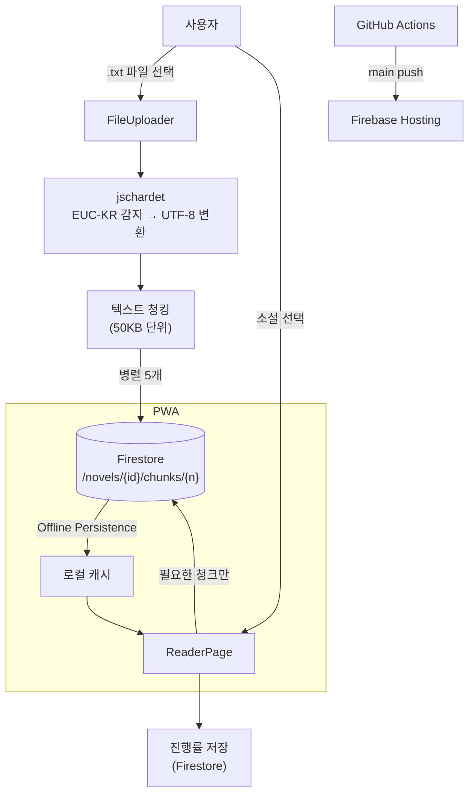

# 글방 (Geul-bang)

개인용 클라우드 웹소설 리더. `.txt` 파일을 업로드하면 기기에 상관없이 이어읽기가 된다.

배포: [geul-bang.web.app](https://geul-bang.web.app)

---

## 문제 → 선택 → 결과

**문제.** 한국 웹소설 `.txt` 파일(EUC-KR 인코딩)을 PC와 모바일에서 이어읽고 싶다. Firebase Storage를 쓰면 CORS 오류, 권한 설정 복잡성, 30MB 업로드 제한이 발목을 잡았다.

**선택.** Storage 의존성을 완전히 걷어내고 Firestore에 텍스트를 청크(chunk)로 쪼개 저장한다. 청크 5개를 병렬 업로드하고, 읽을 때는 필요한 청크만 가져온다. 인코딩은 `jschardet`으로 EUC-KR을 자동 감지해 UTF-8로 변환한다.

**결과.** 업로드 속도 Storage 대비 5×, 30MB 제한 없음, CORS 오류 0. PWA로 오프라인 읽기 지원.

---

## 기술 스택 & 선택 이유

| 기술 | 버전 | 선택 이유 |
|------|------|-----------|
| **React 19** | latest | Concurrent 렌더링으로 대용량 텍스트 페이지네이션 시 UI 블로킹 없음 |
| **Vite** | 8.x | 빠른 HMR. Firebase Hosting 정적 배포와 궁합이 좋음 |
| **Panda CSS** | latest | CSS-in-JS 없이 타입 안전한 유틸리티. 런타임 오버헤드 없음 |
| **Firebase Firestore** | v10 | 청크 병렬 업로드에서 Storage보다 권한 설정이 단순함. Offline Persistence로 PWA 오프라인 지원 |
| **Firebase Auth** | v10 | Google OAuth 5줄로 끝남. 개인용이라 별도 인증 서버가 필요 없음 |
| **jschardet** | latest | 한국 웹소설 파일 대부분이 EUC-KR. 인코딩을 자동 감지해 UTF-8로 변환 |
| **React Router v7** | latest | 라이브러리 → 파일 기반 라우팅 전환 없이 SPA 라우팅 |

---

## 아키텍처



---

## 프로젝트 구조

```
Geul-bang/
├── geul-bang/              # React SPA
│   └── src/
│       ├── components/
│       │   ├── auth/       # 로그인 (Google OAuth)
│       │   ├── library/    # 소설 목록 + 업로드
│       │   └── reader/     # 리더 설정, 페이지 컨트롤
│       ├── hooks/
│       │   ├── useReader.js      # 텍스트 페이지네이션
│       │   ├── usePageMode.js    # 페이지/스크롤 모드 전환
│       │   └── useNovels.js      # Firestore 소설 목록
│       ├── pages/
│       │   ├── LibraryPage.jsx   # 서재
│       │   └── ReaderPage.jsx    # 리더
│       └── services/
│           ├── novel.service.js  # 청크 업로드/다운로드
│           └── storage.service.js
├── firestore.rules
└── .github/workflows/      # main push → Firebase Hosting 자동 배포
```

---

## 핵심 구현: Firestore 청크 저장

Storage CORS/권한 이슈를 우회하고 업로드 속도를 높인 핵심 결정.

```javascript
// 50KB 단위로 청킹 후 5개씩 병렬 업로드
async function uploadNovel(text) {
  const CHUNK_SIZE = 50 * 1024;
  const chunks = [];

  for (let i = 0; i < text.length; i += CHUNK_SIZE) {
    chunks.push(text.slice(i, i + CHUNK_SIZE));
  }

  // 5개씩 병렬 처리 (순차 대비 5× 속도)
  for (let i = 0; i < chunks.length; i += 5) {
    await Promise.all(
      chunks.slice(i, i + 5).map((chunk, j) =>
        setDoc(doc(db, `novels/${id}/chunks/${i + j}`), { text: chunk })
      )
    );
  }
}
```

### 트레이드오프

| 항목 | Firebase Storage | Firestore 청크 |
|------|-----------------|----------------|
| 업로드 속도 | 1× | **5×** (병렬) |
| 파일 크기 제한 | 30MB | 제한 없음* |
| CORS 설정 | 복잡 | 불필요 |
| Offline 지원 | 별도 구현 | Persistence 내장 |
| 읽기 비용 | Storage 요금 | Firestore 문서 읽기 요금 |

> *Firestore 문서당 1MB 제한. 50KB 청크로 분할하므로 사실상 무제한.

---

## 실행

```bash
cd geul-bang
npm install
npm run dev
```

## 배포

```bash
# 빌드 + Firebase Hosting 배포
npm run build
firebase deploy --only hosting
```

GitHub `main` 브랜치 push 시 GitHub Actions로 자동 배포.
